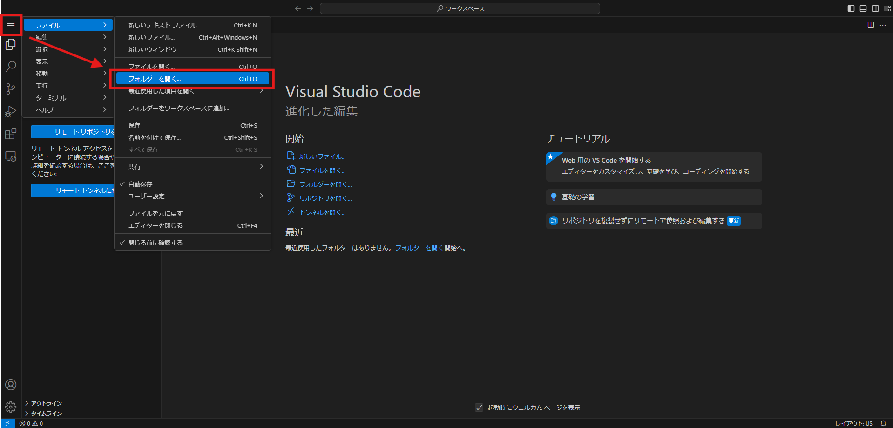
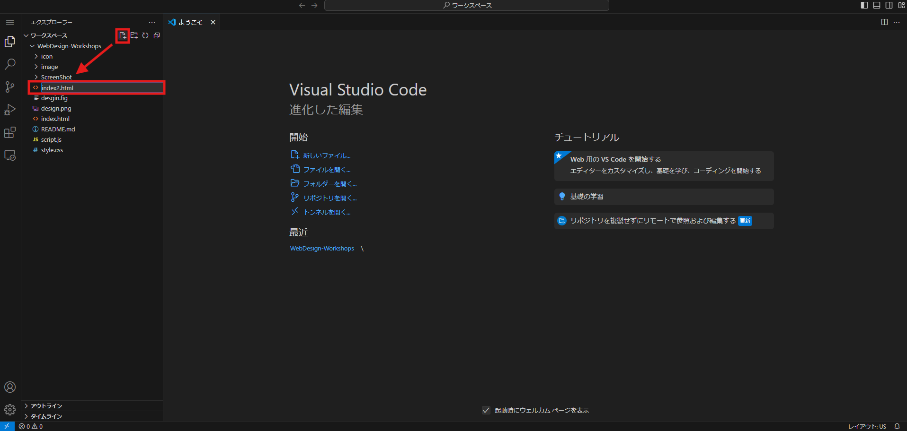
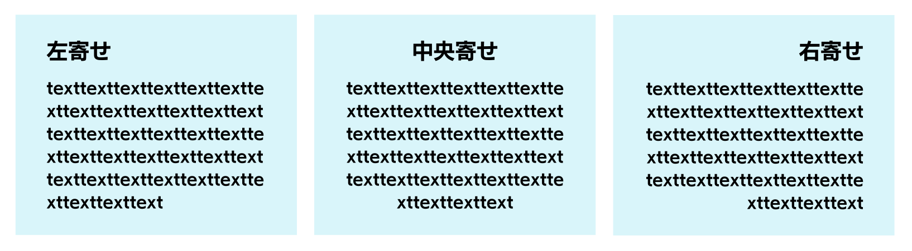
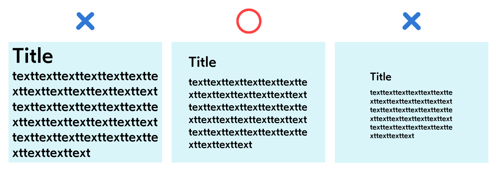
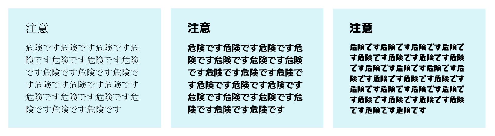
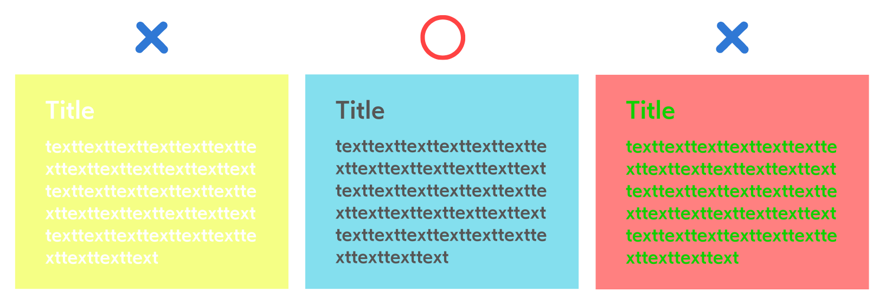

# デザイン×プログラミング講座

[株式会社DREAMSQUARE](https://dreamsquare.tech)　安藤 太亮（あんどう たいすけ）

- [Web版のVSCodeはこちら](https://vscode.dev/?vscode-lang=ja-jp)

- [Figmaへのアクセスはこちら](https://www.figma.com)

- [Figmaプロアカウント設定](https://www.figma.com/ja-jp/education/)

- [Figmaデザインテンプレートはこちら](https://www.figma.com/proto/DApg2LJfIj9Yykl7ZaOWxd/PROFILE-SITE?node-id=1-3&t=yTWzBxkXyVrzAMuT-1&scaling=scale-down-width&content-scaling=fixed&page-id=0%3A1)

## 本講義の目標

Webサイトの仕組みについて学び、要件定義をもとにデザインする力を身に着ける。

## もくじ

- [デザイン×プログラミング講座](#デザインプログラミング講座)
  - [本講義の目標](#本講義の目標)
  - [もくじ](#もくじ)
  - [1. Webサイトの仕組み](#1-webサイトの仕組み)
  - [2. Webサイトの実装](#2-webサイトの実装)
  - [3. Webサイトのデザインの作り方](#3-webサイトのデザインの作り方)
  - [4. プロジェクトベースのWeb開発](#4-プロジェクトベースのweb開発)

## 1. Webサイトの仕組み

- ### 1.1. Webサイトの種類と用途

    皆さんは普段、どんな時にWebサイトを利用しますか？おそらく、一言では言い表せられないほど多くのシーンでWebサイトを使用していると思います。インターネット上には19億（アクティブなサイトは5億程度）のWebサイトがあり、それらのサイトの用途は様々で、ここでは9つWebサイトの種類を紹介します。

    |種類                     |説明                         |
    |-------------------------|----------------------------|
    |オウンドメディア          |企業が所有する情報発信サイト<br>(例) [【サイボウズ式】新しい価値を生み出すチームのメディア](https://cybozushiki.cybozu.co.jp/)|
    |ECサイト                 |商品やサービスを販売するオンラインショップ<br>(例) [【Amazon】本、ファッション、家電から食品まで](https://www.amazon.co.jp/)|
    |コーポレートサイト        |企業の概要や活動を紹介するサイト<br>(例) [【株式会社共和モータース】想いをつなぐカーライフサポート](https://d-kyowam.com/)|
    |ランディングページ（LP）  |特定のキャンペーンや商品の宣伝ページ<br>(例) [【熊本県ホームページ】くまモン島](https://www.pref.kumamoto.jp/kumamonisland/)|
    |リクルート（採用）サイト  |求人情報を提供し、採用活動を支援するサイト<br>(例) [【HONDA】グループキャリア採用サイト](https://www.honda-jobs.com/)|
    |ポータルサイト            |多種多様な情報を集約するサイト<br>(例) [【Yahoo!JAPAN】日本最大のポータルサイト](https://www.yahoo.co.jp/)|
    |プロモーションサイト      |特定の商品やイベントを宣伝するサイト<br>(例) [【アサヒ飲料】カルピス](https://www.cocosauna.jp/)|
    |サービスサイト            |サービスの詳細や利用方法を説明するサイト<br>(例) [【株式会社JOE】ココサウナ](https://cybozushiki.cybozu.co.jp/)|
    |ブランドサイト            |ブランドの世界観を伝えるサイト<br>(例) [【Apple】AppleVisionPro](https://www.apple.com/jp/apple-vision-pro/)|

- ### 1.2.  Webサイトを表示する仕組み

    Webサイトが表示されるまでの過程を4つに分けて紹介します。

    - #### 1. DNSサーバへの問い合わせ

        URLに含まれるドメイン（例：dreamsquare.tech）からDNSサーバー（ドメインとIPアドレスを紐づけるサーバー）にWebサーバーのIPアドレス（ネットワークに接続する端末や機器に割り当てられている識別番号）を問い合わせます。
    
    - #### 2. 端末にIPアドレスを送信

        Webサイトにアクセスする端末に、DNSサーバーから接続先のIPアドレスが送信されます。
    
    - #### 3. Webサーバーにデータを要求

        DNSサーバーから取得したIPアドレスをもとにWebサーバーにアクセスし、Webサイトを表示するのに必要なデータを要求します。
    
    - #### 4. Webサイトをブラウザに表示

        Webサーバーから取得したデータをWebブラウザ上に表示します。

- ### 1.3. Webサイトの暗号化

    上記で説明したWebサイトを表示する手順からもわかるように、Webサイトの利用にはインターネットを通じた多くのデータの送受信を伴います。そのデータの中には、パスワードやクレジットカード番号といった重要な情報が含まれる場合もあります。そこでWebサイトを暗号化することによって、それらの重要なデータが漏洩することを防ぎます。一般的に、暗号化には**TLS**（Transport Layer Security）という技術が用いられ、暗号化されているサイトのURLは**https**から始まります。一方で、暗号化されていないWebサイトのURLは**http**から始まります。


## 2. Webサイトの実装

- ### 2.1. VSCodeについて

    Webサイトの総コード数は、数千行に及びます。エンジニアはそんな膨大なコードのうち、どのコードがどんな役割を担っているかを見分ける必要があります。仮に、HTMLのコードがすべて1行に収まっていたとするとどうでしょう？必要なコードを見つけ出すのに多くの時間がかかると思います。VSCode（Visual Studio Code）は、複雑なコード間の関係性を感覚的に理解できるようにコードを見やすく整えられるテキストエディタです。さらに、拡張機能を追加することで間違ったコードを強調表示することもできます。以下に、VSCodeの基本操作を示します。

    [Web版のVSCodeはこちら](https://vscode.dev/?vscode-lang=ja-jp)

    - #### フォルダの読み込み
  
        [ファイル]>[フォルダを開く]の手順で使用するフォルダを選択します。
        
        

    - #### ファイルの作成

        左上のアイコンをクリックし、適切なファイル名と拡張子を入力することで、新しいファイルを作成することができます。

        

- ### 2.2. Webサイトを構成するファイル

    Webページは主に**HTML**、**CSS**、**JavaScript**の3つのファイルで構成さており、それぞれのファイルが重要な役割を担っています。

    |ファイル|役割|
    |---|---|
    |HTML|タグと呼ばれる要素で、テキストや画像、リンクなどのコンテンツを配置する、Webページの基本的な構造を定義するマークアップ言語|
    |CSS|HTMLで作成された要素に対して、色、フォント、配置、余白などのWebページの見た目やレイアウトを定義するためのスタイルシート言語|
    |JavaScript|Webページにインタラクティブな機能を追加するためのプログラミング言語で、ユーザーの操作に応じて、ページの内容を動的に変更したり、アニメーションを作成したり、フォームの入力を検証したりすることができる|

- ### 2.3. HTMLを書いてみよう

    |コード|機能|
    |---|---|
    |`<!DOCTYPE html>`|HTMLの文章であることを宣言|
    |`<html> </html>`||
    |`<head> </head>`||
    |`<title> </title>`||
    |`<body> </body>`||

    上で紹介したコードをもとに、最低限のHTMLの構成は以下のようになります。

    ```html
    <!DOCTYPE html>
    <html>
        <!--Webサイトの設定-->
        <head>
            <meta charset="utf-8">
            <title>タイトル</title>
            <link rel="stylesheet" href="style.css">
        </head>
        <body>
            <!--ここに表示させる内容を記述-->
        </body>
    </html>
    ```
    次に、Webサイトの必要な情報を表示させるためのHTMLを紹介します。

    |コード|機能|
    |---|---|
    |`<h1> </h1>`||
    |`<h2> </h2>`||
    |`<p> </p>`||
    |`<a> </a>`||
    |``||
    |`<div>`||

    上で紹介したコードを使って、簡単なWebサイトのHTMLを書いてみましょう。以下のコードは最低限のHTMLの構成のうち、`<body>`タグの中に記述してください。

    ```html
    <div>
    ```
    
- ### 2.4. CSSを書いてみよう

    - クラスの概念
    - IDの概念

- ### 2.5. JavaScriptを書いてみよう

    - ボタンを華やかに

- ### 2.6. Figmaを活用した実装

    - 開発者モードについて
    - プラグインについて

## 3. Webサイトのデザインの作り方

- ### 3.1. デザインの大切さ

    みなさんは、デザイン性が優れているサイトを見たときに何を考えますか？多くの人は、Webサイトを運営している組織への信頼が高まるのではないでしょうか。一方で、デザイン性が劣っているサイトは、サイトを訪問したユーザーがサイトの内容を見る前に、負の印象を与えてしまう可能性があります。このように、Webサイトのデザインは組織としての信頼性を得る上でも重要な役割を果たします。

- ### 3.2 UI/UX とは
    
    UI（ユーザーインターフェース）とは、視覚的なデザイン要素を指し、UX（ユーザーエクスペリエンス）とは、ユーザーのサイトの使用感、満足度を指します。上で、デザインの大切さについて述べましたが、「デザイン性が優れている」とは具体的に、どのようなデザインを指すのでしょうか。Webサイトは、ユーザーに情報を伝えることが一番大きな目的となります。したがって、UI/UXが優れており、ユーザーが視覚的に動作や情報を理解でいるWebサイトが、デザイン性が優れていると言えるでしょう。

- ### 3.3. デザインの基本

    以下にWebサイトのデザイン開発において、重要になる項目を提示します。

    - #### 左寄せ、中央寄せ、右寄せ

        

    - #### 余白の大切さ

        

    - #### 書体の種類と与える印象

        

    - #### 色使いの大切さ

        

- ### 3.4. Figmaの使い方

    - Figmaってなに？
    - アカウント登録
    - フレームの作成
    - オブジェクトの配置と詳細設定
    - スクロール表示の作り方
    - ボタン遷移のつくりかた

## 4. プロジェクトベースのWeb開発

- ### 4.1. プロジェクトの流れ

  - #### 1. 契約書の締結 
    
    契約書の締結はプロジェクトのスタート地点です。エンド企業と受託開発企業が合意し、プロジェクトの範囲や納期、価格などを明確にします。契約書には以下の内容を明記します。

    |項目|内容|
    |---|---|
    |プロジェクトの目的と範囲|何を開発するのか、どの機能が含まれるのかを明確にします。|
    |納期とマイルストーン|プロジェクトの進捗を管理するための期限を設定します。|
    |価格と支払い条件|受託開発企業への支払いスケジュールや料金を合意します。|
    |知的財産権と機密保持|プロジェクトで生成される知的財産の権利と機密情報の取り扱いについて規定します。|

  - #### 2. 要件定義

    要件定義はプロジェクトの成功に欠かせないステップです。エンド企業からの要件をヒアリングし、具体的な仕様をまとめます。これがプロジェクトの方向性を決める重要な段階です。要件定義書には以下の情報が含まれます。

    |項目|内容|
    |---|---|
    |機能要件|ユーザーがどのような操作を行えるか、どの機能が必要かを明確にします。|
    |非機能要件|性能、セキュリティ、ユーザビリティなどの要件を定義します。|

  - #### 3. 開発・テスト
    開発フェーズでは実際のコード作成が行われます。プログラムの品質を保つためにテストも重要です。ユニットテストや結合テストなどを実施します。テストフェーズではバグの発見と修正、パフォーマンスの評価が行われます。

  - #### 4. リリース

    開発が完了したら、最終的なテストを実施し、ユーザーが利用できるように公開されます。

  - #### 5.保守管理 

    プロジェクトがリリースされた後も、バグ修正や新機能の追加、セキュリティ対策などを行います。

- ### 4.1. Webサイト開発の手順

  - #### 1. 情報を整理する

    プロジェクトの初めに、要件定義をもとに必要な情報を整理し、サイトの構成や目的を明確にします。

  - #### 2. Figmaでデザインを作る

    Figmaを使用して、Webサイトのデザインを作成します。ユーザーインターフェースやレイアウトを視覚化します。

  - #### 3. VSCodeでHTML・CSS・JSを実装する

    Visual Studio Codeを使って、HTML、CSS、およびJavaScriptでデザインをコーディングします。

- ### 4.2. Webサイトの開発にかかるお金

    Webサイトの開発には主に以下の費用がかかります。

    |費目|概要|
    |----|---|
    |サーバー代|Webサイトのホスティングにはサーバー代が必要です。さくらサーバーやConoha Wingなどが有名で、選ぶプランにより月額費用は異なり、個人サイトレベルであれば、相場500-1500円(/月)ほどになります。|
    |ドメイン料金|サイトのURLとなるドメイン名の取得には料金がかかり、相場1000-2000円(/年)ほどになります。人気の年間契約が一般的です。|
    |SSL証明書発行料金|Webサイトのセキュリティを確保するためのSSL証明書の発行には費用が発生します。基本的には無料ですが、セキュリティーを高くする必要があるサイトの場合、相場800-1500円(/年)ほどになります。|
    |Webサイト開発費|Webサイトのデザインや実装、テストなどを行うための開発費用が必要です。会社に制作を委託する場合、相場10-30万円ほどになります。より細かな演出などを加える場合、100万円を超えるものもあります。|
